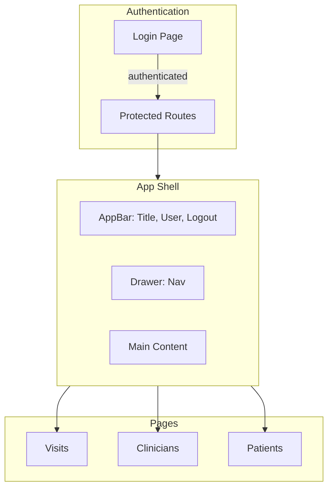

# Patient Visit Tracker — UI Architecture

## Overview

The frontend is a React SPA built with Vite, Material UI, and React Router. It follows a feature-based structure optimized for forms, tables, and internal admin workflows.

---

## UI Flow



---

## Routing

| Path      | Access   | Description                    |
| --------- | -------- | ------------------------------ |
| `/login`  | Public   | Login form (email only, mock)   |
| `/`       | Protected| Redirects to `/visits`         |
| `/visits` | Protected| Record and view visits         |
| `/clinicians` | Protected| Manage clinicians          |
| `/patients`   | Protected| Manage patients            |
| `*`       | Fallback | Redirects to `/`              |

**Auth behavior:** Unauthenticated users hitting protected routes are redirected to `/login`. On successful login, users land on `/visits`.

---

## Layout Structure

### AppLayout

- **AppBar:** Product title ("Patient Visit Tracker"), user email, logout button
- **Drawer (left):** Navigation links
  - Visits
  - Clinicians
  - Patients
- **Responsive:** Permanent drawer on desktop (md+), temporary overlay on mobile

### Navigation

- All non-login routes use `AppLayout` via `Layout` (re-export of `AppLayout`)
- Nav items highlight on active route

---

## Page Structure

### Clinicians Page (`/clinicians`)

1. **PageHeader** — "Clinicians" / "Manage clinician records"
2. **SectionCard "Add Clinician"** — Form (first name, last name, specialty)
3. **SectionCard "Clinicians"** — List or EmptyState / LoadingState

**Data flow:** Fetch list on mount; on create success, refetch list.

---

### Patients Page (`/patients`)

1. **PageHeader** — "Patients" / "Manage patient records"
2. **SectionCard "Add Patient"** — Form (first name, last name, date of birth)
3. **SectionCard "Patients"** — List or EmptyState / LoadingState

**Data flow:** Same pattern as Clinicians.

---

### Visits Page (`/visits`)

1. **PageHeader** — "Visits" / "Record and view patient visits"
2. **SectionCard "Filters"** — Clinician and Patient filter dropdowns (FilterBar)
3. **SectionCard "Record Visit"** — Form (clinician, patient, date/time, notes)
4. **SectionCard "Visit History"** — Table (Date & Time, Clinician, Patient, Notes)

**Data flow:** Fetch clinicians and patients on mount; fetch visits with filter params; on create success, refetch visits.

---

## Component Hierarchy

```
App
├── AuthProvider
│   └── BrowserRouter
│       └── ThemeProvider
│           ├── Routes
│           │   ├── /login → LoginPage
│           │   └── / → ProtectedRoute
│           │       └── Layout (AppLayout)
│           │           └── Outlet
│           │               ├── CliniciansPage
│           │               ├── PatientsPage
│           │               └── VisitsPage
```

---

## Shared Components

| Component    | Purpose                                      |
| ------------ | -------------------------------------------- |
| PageHeader   | Page title, subtitle, optional actions        |
| SectionCard  | Card wrapper for forms and content sections  |
| EmptyState   | No-data state with icon and optional action  |
| LoadingState | Centered loading indicator with message      |
| FilterBar    | Layout container for filter controls         |
| FormActions  | Submit/cancel button alignment               |

---

## Feature Components

| Feature    | Components                                      |
| ---------- | ----------------------------------------------- |
| Auth       | AuthContext, LoginForm, ProtectedRoute           |
| Clinicians | ClinicianForm, ClinicianList                    |
| Patients   | PatientForm, PatientList                        |
| Visits     | VisitForm, VisitsTable, VisitList (legacy)      |

---

## Theme

- Central theme in `src/theme.js`
- Custom palette, typography, spacing, and component overrides
- Targets admin-style UI: light greys, subtle elevation, clear hierarchy

---

## Authentication (Mock)

- **Context:** AuthContext holds user state
- **Storage:** localStorage for persistence
- **Login:** Email only, no backend
- **Logout:** Clears context and localStorage, redirects to `/login`

---

## API Integration

- Axios client in `src/services/api.js`
- Base URL from `VITE_API_URL` or fallback
- Vite proxy maps `/api` and `/health` to backend during dev

---

## File Structure

```
apps/web/src/
├── App.jsx
├── main.jsx
├── theme.js
├── index.css
├── components/
│   ├── AppLayout.jsx
│   ├── Layout.jsx
│   └── shared/
│       ├── PageHeader.jsx
│       ├── SectionCard.jsx
│       ├── EmptyState.jsx
│       ├── LoadingState.jsx
│       ├── FilterBar.jsx
│       ├── FormActions.jsx
│       └── index.js
├── features/
│   ├── auth/
│   ├── clinicians/
│   ├── patients/
│   └── visits/
├── pages/
│   ├── LoginPage.jsx
│   ├── CliniciansPage.jsx
│   ├── PatientsPage.jsx
│   └── VisitsPage.jsx
└── services/
    └── api.js
```
